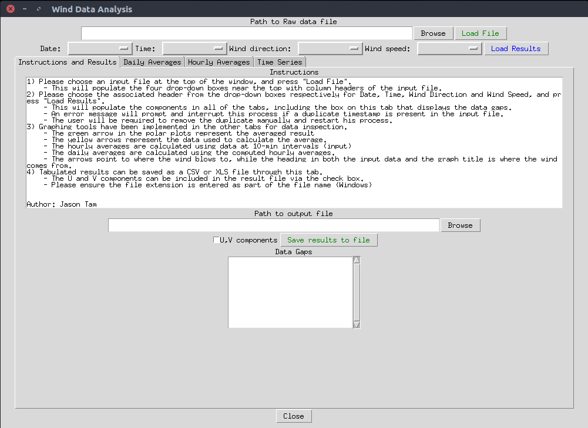
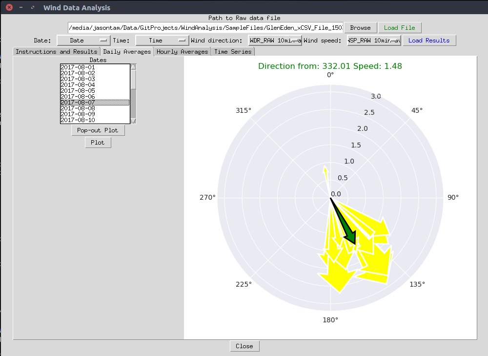
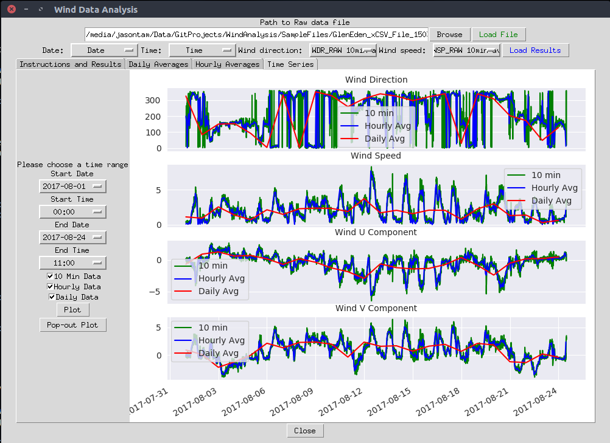

## Wind Energy Analyzer using ML

##### I am updated all over the Problem statement with proposed solution
https://docs.google.com/presentation/d/1NiZTAchuHnt21jQxmdQuTbT5s1FDGix9ZknPnxkZ2co/edit?usp=sharing

# WindAnalysis Report Generator #

## Overview ##

This is a simple software with a Graphical User Interface written in python, with the intention of assisting the inspection of wind data collected from ultrasonsic wind sensors.

Ultrasonic wind sensors are commonly used in the air quality monitoring discipline. Each of the various models available on the market have their own minimal sample interval. This application has been written to process measurements at 10 miniute intervals, with the focus for analysis of hourly and daily averages.

Speed and direction is logged by the wind sensor at 10 minute intervals. Different tabs have been implemented to compare the data logged at 10 minute intervals as well as the hourly and daily averages computed by them. The speed and direction components of each measurement interval are vectorized for the averaging procedure. A time-series display is also implemented to view the entire dataset. All results can be saved in a CSV format. 

## Remarks ##

This software was originally written in Python 2.7 in a linux environment, and was converted to become compatible with Python 3.x. Several libraries such as **tkinter**, **pandas**, **pandasql** and **seaborn** may need to be installed via pip to run the application. Small adjustments to the code might be required to run the application under the Windows environment.

## Screenshots ##

The following are a few screenshots of the application:

 

 

 

